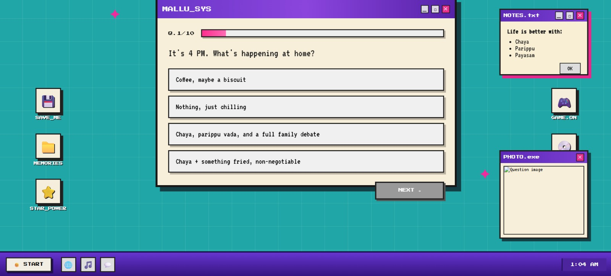
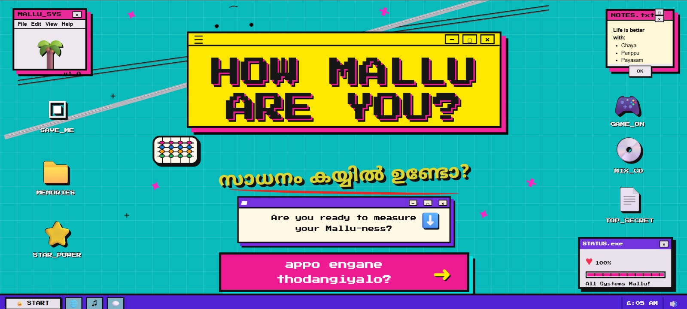

# MALLU-METER🎯

## Basic Details
### Team Name: USELESS DUO

### Team Members
- Team Lead: V. RINOSHA PRAKASH- GOVT. MODEL ENGINEERING COLLEGE ERNAKULAM
- Member 2: ANN SARA SUMAN - GOVT. MODEL ENGINEERING COLLEGE ERNAKULAM

### Project Description
Think you are a true 'Malayali'??? Mallu-Meter is here to expose you.
Answer a series of brutally important questions about Malayalam culture, food, slang, cinema, and everyday Mallu behaviour to calculate your ultimate Mallu Level. 🥥☕💀

### The Problem (that doesn't exist)
In a world where nobody knows exactly how Malayali they are, there is a severe lack of reliable technology for measuring Mallu-ness. Mallu Meter solves this completely unnecessary crisis by determining your Mallu Level through highly questionable questions and advanced nonsense.

### The Solution (that nobody asked for)
We built Mallu Meter, a highly sophisticated and completely unnecessary system that asks you a series of questions about Malayalam culture, food, cinema, slang, and everyday Mallu behaviour. Based on your answers, our proprietary “Mallu Science™” calculates your Mallu Level and reveals whether you are a Certified Malayali or a cultural impostor. 🥥☕💀

## Technical Details
### Technologies/Components Used
For Software:
- Languages used -HTML, CSS, JavaScript
- Tools used -Visual Studio Code, GitHub, Web Browser

### Implementation
For Software:
# Installation
No additional installation or dependencies are required. The project runs directly in a web browser.

# Run
Open index.html in any modern web browser.

Alternatively, use VS Code Live Server to launch the project locally.

### Project Documentation
For Software:

# Screenshots (Add at least 3)

![Screenshot1]
(ss/1.jpeg)
*Initial design of home page*

*Questionaire layout*

*Final design of home page*

# Diagrams
              ┌─────────────────┐
              │   Start Mallu   │
              │      Meter      │
              └────────┬────────┘
                       ↓
              ┌─────────────────┐
              │ Answer Mallu    │
              │   Questions     │
              └────────┬────────┘
                       ↓
              ┌─────────────────┐
              │ Calculate Mallu │
              │      Score      │
              └────────┬────────┘
                       ↓
              ┌─────────────────┐
              │ Determine Mallu │
              │      Level      │
              └────────┬────────┘
                       ↓
              ┌─────────────────┐
              │  │
                Funny Verdict │
              └────────┬────────┘
                       ↓
              ┌─────────────────┐
              │   Certified     │
              │    Mallu? 🥥    │
              └─────────────────┘

**Figure: Mallu Meter Workflow**

The user answers a series of questions related to Malayalam culture, food, cinema, slang, and everyday Malayali behaviour. The application processes the responses, calculates a Mallu Score, assigns a corresponding Mallu Level, and displays a humorous final verdict.

### Project Demo
# Video
(https://drive.google.com/file/d/1WDuynhlPeF-cSL9O3imd6mtSmjYM2lIv/view?usp=drivesdk)
1. User starts Mallu Meter
Clicks “Measure My Mallu Level”
The quiz begins.
2. They answer a series of Mallu questions
Malayalam cinema
Food
Slang
Kerala culture
Everyday Malayali behaviour

3. The site processes their answers

4. Just when they expect the Mallu Level...

The screen says something like:

YOUR MALLU LEVEL HAS BEEN CALCULATED.

'Click below to reveal your result.'

They click it.

💀 PRANK VIDEO.

Instead of revealing whether they're Certified Mallu, the website plays a chosen old Malayalam movie clip.

That makes the video itself the punchline, rather than a conventional result screen.

## Team Contributions
- V. Rinosha Prakash:Contributed to the overall development through collaborative vibe coding. Worked on the JavaScript functionality, quiz logic, scoring mechanism, interactions, animations, and prank-result flow. Also assisted with debugging, testing, and refining the final application.

- Ann Sara Suman: Contributed to the overall development of Mallu Meter through collaborative vibe coding. Worked on the website structure, UI design, styling, quiz interface, and integration of the different components. Also helped refine the Malayalam-themed visual elements and user experience.

---
Made with ❤️ at TinkerHub Useless Projects 

